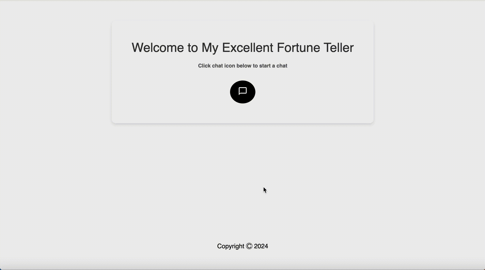

# My Excellent Forune Teller

## Overview
The Excellent Fortune Teller is a web application that allows users interact with aforyune-telling bot. The application uses a client-server architecture where the client is built with React, and the server is built with Node.js and Express. The server analyzes the user's input to determine whether it contains more positive and negative words and then responds with an appropriate fortune.

## Demo

## Features
1. <b>Interactive Chat Interface:</b>  Users can chat with the bot, startung with a prompt asking about their day.
2. <b>Fortune Telling:</b> Based on the user's resonse, the server provides a fortune, which can be positive or negative.
3. <b>Retry Option:</b> After receiving a fortune, users can choose to get another fortune or end the chat

## Installation
1. Clone or doenload repository to your local machine.
2. Make sure you have Node.js and npm installed.
3. Navigate to your project directory in your terminal.
4. Navigate to your server directory in your terminal by running `cd fortune-teller-server`.
5. Run `npm install` to install the project depenedies for the server side.
6. Open a new terminal and navigate to your client directory by running `cd fortune-teller-client`.
7. Run `npm install` to install the project depenedies for the client side.

## Usage
1. In the client side terminal, run `npm run dev`.
2. In the server side terminal, run `node index.js`.
3. Open your browser and navigate to http://localhost:5132.
4. Click the chat icon to go to the chat window.
5. Respond to the bot and receive a fortune for the day.

## Acknowledgements
Special thanks to the creators of React and Node.js for their amazing tools and frameworks.
